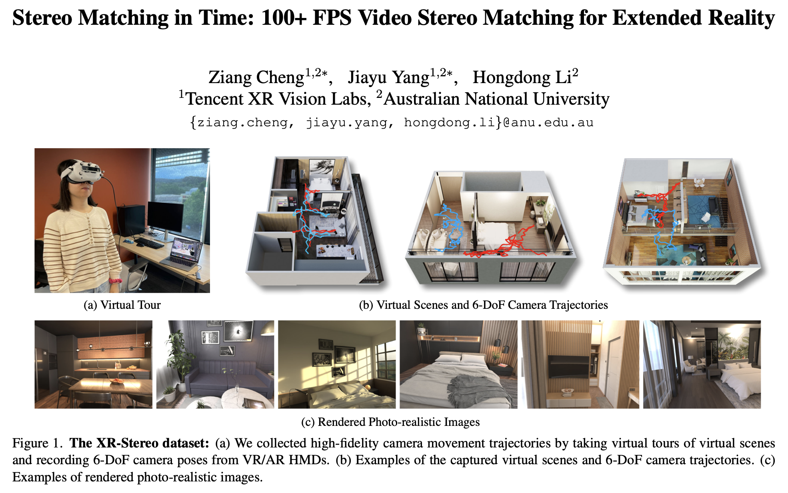

### XR-Stereo Dataset



This release presents a 640x480 version (57.4G) of the dataset that is specifically built for indoor stereo matching. We grant unlimited use of this release under the CC BY 4.0 license. For full dataset (~4TB) please contact authors for license and permission.

Stereo images, disparity maps and camera parameters are prepared in [SceneFlow format](https://lmb.informatik.uni-freiburg.de/resources/datasets/SceneFlowDatasets.en.html). Zipped data is hosted on [Google Drive](https://drive.google.com/file/d/1wUauIcW2A1L6biP7qn6x14ce0fXdT9Tm/view) and can be downloaded with `gdown` package.
```bash
pip install gdown
gdown --fuzzy https://drive.google.com/file/d/1wUauIcW2A1L6biP7qn6x14ce0fXdT9Tm/view
```

Please consider citing our paper if you find it helpful.
```bibtex
@InProceedings{Cheng_2024_WACV,
    author    = {Cheng, Ziang and Yang, Jiayu and Li, Hongdong},
    title     = {Stereo Matching in Time: 100+ FPS Video Stereo Matching for Extended Reality},
    booktitle = {Proceedings of the IEEE/CVF Winter Conference on Applications of Computer Vision (WACV)},
    month     = {January},
    year      = {2024},
    pages     = {8719-8728}
}
```


